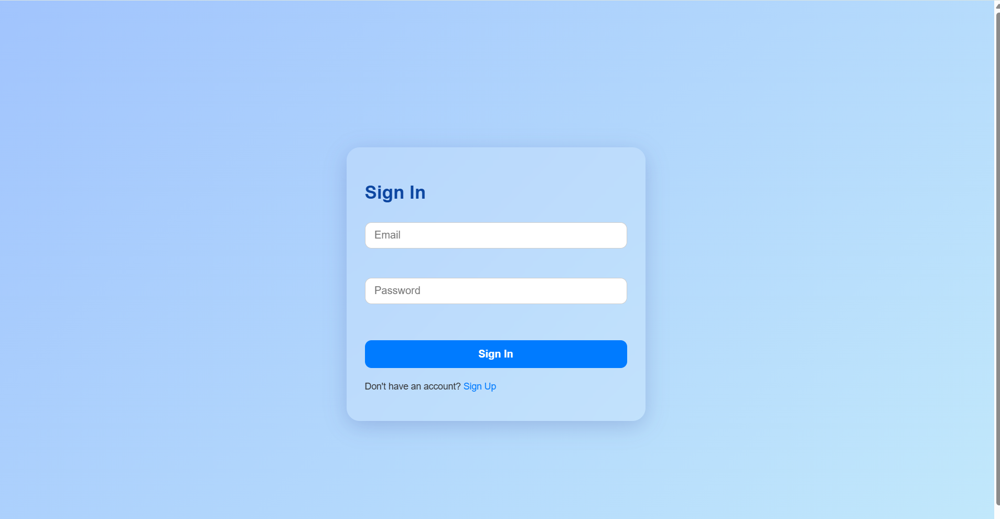
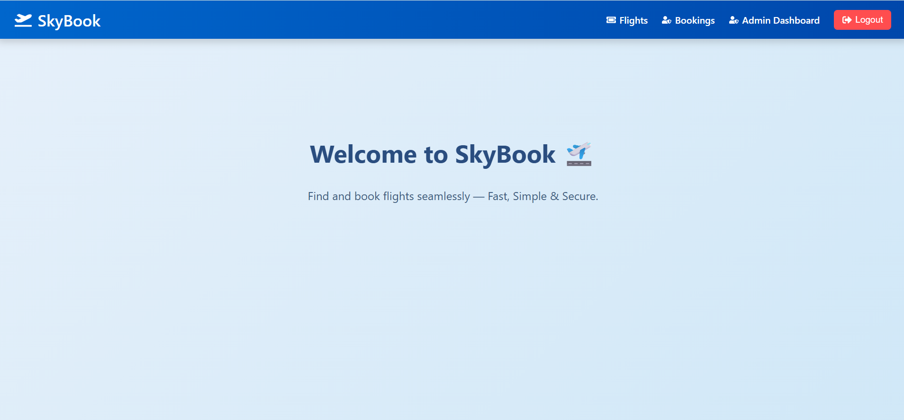
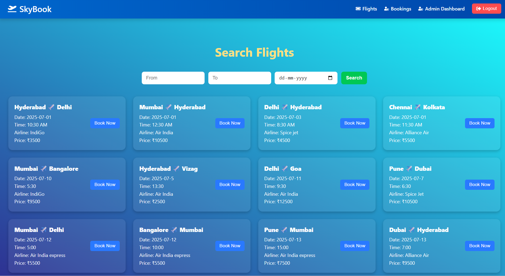
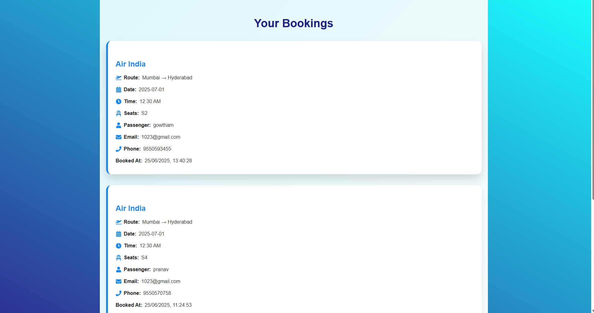
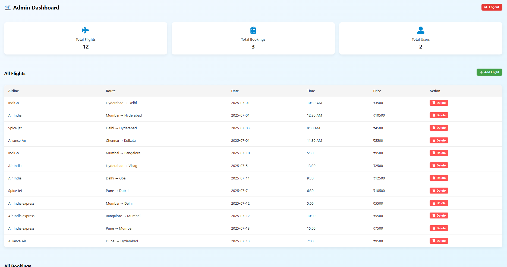

# ✈️ Flight Booking System

A full-stack **Flight Booking Web Application** that allows users to search for flights, book seats, make payments via UPI/Card, and view their bookings. It also includes an **Admin Dashboard** to manage flights and monitor bookings. The frontend is styled with modern, Flipkart-style UI and responsive layouts.

---

## 🚀 Features

- 🔐 User Signup & Login with validation
- 🔎 Flight search with filters (source, destination, date)
- 💺 Seat selection (dynamic & interactive)
- 💳 Payment system (UPI/Card) with UI similar to Flipkart
- 📄 Booking confirmation & history
- 🛠 Admin login and dashboard to manage flights & view all bookings
- 📱 Responsive and elegant UI using React + CSS
- 🌈 Smooth user experience with React Router & API integration

---

## 🛠 Tech Stack

**Frontend:**
- React.js
- React Router
- Axios
- React Icons
- CSS3 

**Backend:**
- Node.js
- Express.js
- MongoDB
- Mongoose

---

## 📷 Screenshots

### Login Page



### Home Page



### Flight Search



### Booking Page




### Admin Dashboard



---


## 📦 Installation

### 1. Clone the repository

```bash
git clone https://github.com/your-username/flight-booking-system.git

cd flight-booking-system
